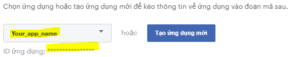

# SIMPLE FACEBOOK LOGIN - FLUTTER APP

______________________________________________
## Preparation
#### 1. Install Flutter: 
Follow instruction to get flutter installed: [Link](https://flutter.dev/docs/get-started/install)

#### 2. Include package: 
We use **flutter_facebook_login** package to authenticate facebook login. To add this package to your project, simply run this code when you're in project folder:
> flutter pub pub add flutter_facebook_login

Or manually add these line in package's pubspec.yaml:
> dependencies: 
>   flutter_facebook_login: **^3.0.0** 

then run following command to get the package:
> flutter pub get

#### 3. Import the package: 
Add this code to your dart file:
> import 'package:flutter_facebook_login/flutter_facebook_login.dart';

______________________________________________
## Create main file
Copy those sample code to your **main.dart** file: [Link](https://pub.dev/packages/flutter_facebook_login/example)

______________________________________________
## Register your app with facebook:
#### 1. Create an developer account and make an app in this [Link](https://developers.facebook.com/docs/facebook-login/android)
#### 2. Select desired app from dropdown list: 

#### 3. Open *build.gradle* file in folder *android* and add this line in *buildscript { repositories {}}* section:
> jcenter() 
 
#### 4. Open *build.gradle* file in folder *android/app* and add this line in *dependencies {}* section:
> implementation 'com.facebook.android:facebook-login:[8.1)'
 
#### 5. Create *strings.xml* file in folder *android/app/src/main/res/values* with following contents:
> <?xml version="1.0" encoding="utf-8"?>
> <resources>
>     <string name="app_name">Your App Name here.</string>
>     <string name="facebook_app_id">000000000000</string>
>     <string name="fb_login_protocol_scheme">fb000000000000</string>
> </resources>

**Note: Change *facebook_app_id* and *fb_login_protocol_scheme* with your own app value**

#### 6. Open *AndroidManifest.xml* file in folder *android/app/src/main* and add those line:
> <meta-data android:name="com.facebook.sdk.ApplicationId"
>     android:value="@string/facebook_app_id"/>
> 
> <activity android:name="com.facebook.FacebookActivity"
>     android:configChanges=
>             "keyboard|keyboardHidden|screenLayout|screenSize|orientation"
>     android:label="@string/app_name" />
> 
> <activity
>     android:name="com.facebook.CustomTabActivity"
>     android:exported="true">
>     <intent-filter>
>         <action android:name="android.intent.action.VIEW" />
>         <category android:name="android.intent.category.DEFAULT" />
>         <category android:name="android.intent.category.BROWSABLE" />
>         <data android:scheme="@string/fb_login_protocol_scheme" />
>     </intent-filter>
> </activity>

#### 7. Get app hash code:
Run this code within **java/bin** folder to get app hash code:
> keytool -exportcert -alias androiddebugkey -keystore "C:\Users\**Note: Change *facebook_app_id* and *fb_login_protocol_scheme* with your own app value**\.android\debug.keystore" | "PATH_TO_OPENSSL_LIBRARY\bin\openssl" sha1 -binary | "PATH_TO_OPENSSL_LIBRARY\bin\openssl" base64

**Note: Change *facebook_app_id* and *PATH_TO_OPENSSL_LIBRARY* with your own value**

#### 8. Register your app with facebook:
Open your facebook developer account and paste hash code to your app.

______________________________________________
## Finally: compile your app and enjoy result!
